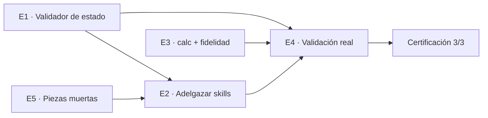

# PRD — De prosa a mecanismo: estado validado, skills ligeros, aritmética determinista, validación real

**Versión:** 1.0 · **Fecha:** 17 septiembre 2026 · **Autor:** Rafa (Sealmetrics) con Claude
**Estado:** Borrador para revisión · **Base:** revisión del plugin 1.13.2 (worktree `seal-copilot-skill-audit-d272b8`), certificación 9, estado real en `~/.seal-copilot`, [auditoría 1.11.0](auditoria-seal-copilot-2026-09-12.md).
**Alcance:** los cinco puntos acordados el 17/09. Queda fuera todo lo que toca el MCP o el backend (motor de alertas nativo, gate del transporte local, calidad de tráfico bajo `stats:read`).

---

## 1. Resumen ejecutivo

Seal Copilot 1.13.2 tiene una metodología de consultor y una batería de gates offline que pasa en verde. Lo que lo sostiene, sin embargo, es prosa: el contrato de estado vive en un archivo Markdown que nadie valida, las reglas de comportamiento se repiten palabra por palabra en doce skills, la aritmética la hace el modelo de cabeza, y la suite certifica coherencia interna contra un mock que nunca se ha contrastado con la API real.

La consecuencia ya es medible. En la certificación 9, que pasó 30 de 31 casos, los skills escribieron doce perfiles y **ninguno** cumple el contrato de `state-schema.md`. El único caso inestable de esa certificación falla por narración entre llamadas, exactamente la regla que más veces está copiada en los skills. Y el servidor MCP de esta máquina anuncia 64 herramientas cuando el snapshot de evals tiene 62.

Este PRD convierte cinco reglas de prosa en cinco mecanismos, en un orden que respeta sus dependencias:

| Epic | Prosa hoy | Mecanismo |
|---|---|---|
| E1 | "These field names are the contract" | Validador de estado en el hook `PreToolUse` sobre `Write`, y en el runner de evals |
| E2 | Tres bloques repetidos en 12 skills, anécdotas de runs reales | Un protocolo de ejecución en un solo archivo, gate de tamaño y de duplicados |
| E3 | "Every number is real" | `calc.mjs` determinista, y una aserción de fidelidad numérica en `assess.mjs` |
| E4 | "Until that command has run clean, a green suite proves self-consistency" | Fixtures validados contra la API real, snapshot al día, transporte por defecto `remote` |
| E5 | Un agente que nadie usa, un bloque `SEAL-STATE` que nadie emite | Borrado, o implementación, y un gate que impide que vuelvan |

Es un único PRD porque las piezas se cruzan: E1 y E3 añaden aserciones que E4 tiene que ejecutar contra datos reales; E2 reescribe los mismos archivos que E1 y E5 tocan. Cinco documentos obligarían a coordinar el orden fuera de ellos.

---

## 2. Problema: evidencia verificada

### P1 · El contrato de estado se incumple con la suite en verde

`evals/results/certification-9.json` (30/31, 13/09/2026) contiene el estado que cada caso dejó en disco. Doce `profile.json` parseados:

| Campo del contrato (`state-schema.md`) | Perfiles que lo escriben | Lo que escribieron en su lugar |
|---|---|---|
| `site_name` | 0 de 12 | `name` (10), `domain` (3), `domains` (9) |
| `events` | 0 de 12 | `event_names` (5), `conversion_event`, `microconversion_events`, `atc_event` |
| `connector` ∈ {`remote`, `local`} | 4 de 7 | `remote-oauth` (3) |
| `discovery_cached_at` | 7 de 12 | `discovered_at` (2), `generated_at`, `first_run`, `stale_after` |
| `product_identifier.{key,table}` | 4 | `product_identifier_table` (1) |

Además aparecen 18 campos que el contrato no define (`lens_tier`, `known_noise_sources`, `baseline_monthly`, `channel_rules_count`…). El archivo dice "the eval suite asserts on them"; `grep stateMustContain evals/cases.mjs` muestra ocho aserciones y ninguna sobre `site_name` ni `events`. La auditoría del 12/09 lo señaló como D4; la respuesta fue añadir el párrafo "Write these names, not synonyms of them", que los runs siguientes no obedecieron.

El perfil real en `~/.seal-copilot/sealmetricsv2/profile.json` sí cumple el contrato, pero lleva dos campos extra (`js_api`, `notes`) y lo escribió una versión posterior a mano.

### P2 · Las reglas se hacen cumplir por repetición

Recuento sobre `seal-copilot/skills/*/SKILL.md` a 17/09:

| Bloque | Skills que lo llevan literal | Palabras por copia |
|---|---|---|
| "Before anything else: emit no text until the report…" | 9 | ~150 |
| "Resolve the site before any call that takes a `site_id`…" | 14 | ~95 |
| "log the run in `runs.jsonl` with exactly these fields…" | 12 | ~110 |
| "Before writing your answer, read `examples/output.md`…" | 15 | ~35 |

Un `weekly-health-check` carga 10.018 palabras de instrucciones antes del primer resultado de herramienta: el core (2.446), `methodology.md` (3.635), `state-schema.md` (2.408), el skill (1.102) y dos golden outputs. El plugin entero son 36.043 palabras de Markdown. Desde 1.12.0 cada corrección es una anécdota ("A real run printed…", "A run did exactly that…") pegada al skill; `create-alert` tiene 2.393 palabras y `check-alerts` 1.507.

El coste es visible: el único caso que no pasó 3 de 3 en la certificación 9 es `drop-isolates-campaign`, por "2 text blocks, cap 1 — narrated between tool calls". La regla está escrita nueve veces.

### P3 · La aritmética la hace el modelo

No existe ningún script de cálculo en `seal-copilot/`. Los skills piden al modelo:

- `calibrate-watchdog`: bucketizar hasta 3.600 filas raw en 168 celdas día×hora, mediana por celda, curva acumulada.
- `product-friction`: cruzar dos pivots de `get_property_breakdown` por SKU, ratio view→AtC, mediana del site, percentil de vistas.
- `create-alert`: tasa por hora activa, λ, e^−λ, falsas alarmas al mes, cola de Poisson para umbrales.
- Todos: deltas período a período, CR, RPE, AOV, impacto = gap × volumen × valor.

`evals/assess.mjs` comprueba regex, llamadas, bloques de texto y estado. No comprueba que ninguna cifra de la respuesta proceda del fixture. La auditoría del 12/09 lo pidió (punto 14) y sigue sin existir.

### P4 · La validación contra la API real es mínima

- `evals/validate-fixtures.mjs` existe y, según el README del plugin, "until that command has run clean, a green suite proves the skills are self-consistent, not that they match the real API". No hay constancia de que haya corrido limpio.
- Uso real: un site, tres runs en `runs.jsonl`. El último (13/09) terminó con `verdict: refused`.
- `evals/mcp-schema.json` tiene 62 herramientas. El servidor `plugin:seal-copilot:sealmetrics` de esta sesión anuncia 64: añade `plan_install` y `simulate_install`, y anuncia también las 20 "gated" (`list_alerts`, `get_bot_stats`, `verify_setup`…). No se ha podido determinar desde la caché del plugin si esa sesión va por el transporte remoto o por el local. Si es el remoto, la regla de detección de conector ("si `list_alerts` no está anunciado, estás en `remote`") que llevan todos los skills está rota hoy.
- El transporte por defecto del mock es `local` (`SEAL_TRANSPORT`). Solo 3 de 35 casos declaran `transport: 'remote'`, que es el conector que `.mcp.json` entrega a todos los usuarios.

### P5 · Piezas muertas o prometidas

- `seal-copilot/agents/sealmetrics-analyst.md`: ningún skill lo invoca (`grep -r sealmetrics-analyst seal-copilot/skills` vacío) y `state-schema.md` prohíbe forkear porque el fork no recibe el state dir.
- `dist/claude-ai/README.md`, generado por `scripts/export-surfaces.mjs`, promete: "Each skill closes with a `SEAL-STATE` block: paste it back when you next open the topic". `grep -r SEAL-STATE seal-copilot/` está vacío.
- `README.md` raíz: "32 cases". `cases.mjs` tiene 35.
- `state-schema.md` y `scripts/usage-report.mjs` usan `impact_eur_month`; la regla 17 del core exige la moneda del site.

---

## 3. Objetivos y no-objetivos

### Objetivos

1. **Un estado inválido no llega al disco.** Todo archivo bajo `<state-dir>` pasa por un validador antes de escribirse, en Claude Code y Cowork; en la suite de evals, después de cada caso.
2. **Cada regla vive en un sitio.** Ningún párrafo de más de 40 palabras aparece en dos archivos del plugin. Un weekly carga como máximo 5.000 palabras de instrucciones.
3. **Cada número es verificable.** Los cálculos que superan una operación se hacen con `calc.mjs`; cada cifra de una respuesta de eval procede de un resultado de herramienta, del cálculo o de una derivación de dos cifras, o el caso falla.
4. **La suite prueba el conector real.** Fixtures contrastados en forma contra la API, snapshot de esquema al día, transporte por defecto `remote`, y una lista de herramientas anunciadas confirmada contra el servidor remoto.
5. **Nada prometido que no exista.** El agente y el bloque `SEAL-STATE` se implementan o se borran, y un gate impide que reaparezcan referencias huérfanas.

### No-objetivos

- Cambios en `@sealmetrics/mcp` o en el backend. Cualquier hallazgo de E4 que necesite uno se registra en `docs/` como encargo, no se implementa aquí.
- Nuevas skills o nuevos patrones de análisis.
- Anomalías estadísticas sobre series diarias (MAD, z-score). `calc.mjs` deja el sitio preparado; el cambio de umbral fijo a relativo es otro PRD.
- Coste, ROAS, pacing, informes HTML.
- Cambiar el formato de estado más allá de lo que E1 exige para poder validarlo.

---

## 4. Orden y dependencias



- **E1 antes que E2**: adelgazar sin validador es reescribir doce archivos sin red. Con el validador, cualquier regresión en nombres de campo la ve el runner, no un lector.
- **E5 antes que E2**: borrar primero lo muerto evita adelgazar texto que va a desaparecer.
- **E3 en paralelo con E1/E2**: es código nuevo; no toca los skills hasta el final (una línea por skill que invoca `calc`).
- **E4 el último**: ejecuta contra datos reales lo que E1 y E3 han convertido en aserciones. Antes de E4 no tiene sentido re-snapshotear, porque E2 y E3 cambian qué llamadas hacen los skills.

---

## 5. Requisitos por epic

### E1 · Validador de estado — P0

**Problema.** P1. El contrato es prosa.

**Cambio.**

1. **`seal-copilot/state/schemas/`**: un archivo de esquema por archivo de estado, en JSON Schema draft-07 pero con un subconjunto acotado (tipos, `required`, `enum`, `additionalProperties: false`, `pattern` para fechas y timestamps, `items` para arrays). Sin dependencias: el validador es propio (`seal-copilot/hooks/scripts/lib/validate.mjs`, ~120 líneas) porque el plugin no tiene `package.json` ni `node_modules`, y un hook que hace `npm install` no es un hook.

   | Archivo | Esquema | Reglas que importan |
   |---|---|---|
   | `profile.json` | `profile.schema.json` | `site_id`, `site_name`, `connector` ∈ {`remote`,`local`}, `timezone`, `currency` (ISO 4217, 3 letras), `vertical` ∈ {`ecommerce`,`hotels`,`saas`,`unknown`}, `events` (objeto con claves `view`, `add_to_cart`, `checkout`, `purchase`, todas opcionales, valores string), `product_identifier` ({`key`,`table`} o `null`), `thresholds`, `targets`, `discovery_cached_at` (`YYYY-MM-DD`, obligatorio), `scheduling_offered`, `account_id` ∈ {`same-as-site`,`refused`,`unknown`}, `first_data_date`. `additionalProperties: false`. |
   | `recommendations.jsonl` | `recommendation.schema.json` (por línea) | `id`, `date`, `skill`, `pattern`, `subject`, `evidence`, `action`, `impact_month` (número), `currency`, `metric`, `baseline`, `target`, `verify_on`, `status` ∈ {`open`,`verified`,`failed`,`discarded`}. **Renombra `impact_eur_month` → `impact_month` + `currency`** (cierra P5 en el ledger y la regla 17). |
   | `runs.jsonl` | `run.schema.json` (por línea) | Exactamente `ts` (ISO UTC), `skill`, `calls` (entero), `budget` (entero), `verdict` (enum, más `^\d+/10$` para audits), `scheduled` (boolean), `notes` (string, ≤ 300). |
   | `alerts.json` | `alerts.schema.json` | `{ site_id, rules: [...] }`. Nunca un array desnudo. Cada regla: la gramática de `create-alert` (`family`, `metric.kind`, `condition` según familia, `active_hours` obligatorio en `silence`/`drop`, `expected` no nulo en `drop`/`spike`). |
   | `watchdog-baseline.json` | `baseline.schema.json` | `mode` ∈ {A,B,C}, `cells` con 7 días × claves `0`–`23` en A/B, `cumulative` con arrays de 24, `expires_at`. |
   | `property-map.md` | ninguno | Markdown para humanos; solo se comprueba que exista una tabla y una fecha. |

2. **Hook `PreToolUse` con matcher `Write`** (`seal-copilot/hooks/scripts/validate-state.mjs`), añadido a `hooks.json`:
   - Lee `tool_input.file_path` y `tool_input.content`. Si la ruta no está bajo `<state-dir>` (`SEAL_COPILOT_STATE_DIR` o `~/.seal-copilot`), sale con `permissionDecision: "allow"` sin más.
   - Elige el esquema por nombre de archivo. Para `.jsonl`, valida cada línea.
   - Si no valida: `permissionDecision: "deny"` y `permissionDecisionReason` con la lista de errores en una línea por error, por ejemplo `profile.json: "name" is not a field; the contract uses "site_name". "connector" must be "remote" or "local", got "remote-oauth".` El modelo recibe la razón y reescribe. Nada llega al disco.
   - Nunca deniega por un archivo que no reconoce, ni cuando el JSON de entrada no se puede parsear (registra y permite). Un hook que rompe por un bug propio es peor que la ausencia de hook.
   - `timeout: 5`.
   - **Legado en lectura, estricto en escritura.** El hook solo valida `Write`. Un perfil anterior a 1.12 sigue siendo legible; el primer skill que lo reescriba tiene que producir uno válido. `state-schema.md` deja de decir "use old state for its facts" con tres párrafos y pasa a decirlo en una línea.

3. **Runner de evals**: en `runCase`, tras leer el estado, cada archivo bajo `state/` se valida con el mismo `validate.mjs`. Un archivo inválido es un fallo del caso con el mensaje del validador. Con esto "the eval suite asserts on them" pasa a ser cierto para los 35 casos, no para los 8 que llevan `stateMustContain`.

4. **`scripts/usage-report.mjs`** lee `impact_month` y `currency`, y agrupa el impacto por moneda.

5. **`self-test.mjs`**: seis casos nuevos sobre `validate.mjs`: perfil válido pasa, `name` en vez de `site_name` falla con el mensaje que nombra el campo correcto, `connector: "remote-oauth"` falla, `alerts.json` como array desnudo falla, `runs.jsonl` con `calls_used` falla, línea `jsonl` malformada falla nombrando la línea.

**Archivos.** `seal-copilot/hooks/hooks.json`, `seal-copilot/hooks/scripts/validate-state.mjs`, `seal-copilot/hooks/scripts/lib/validate.mjs`, `seal-copilot/state/schemas/*.schema.json`, `evals/run-evals.mjs`, `evals/self-test.mjs`, `scripts/usage-report.mjs`, `state-schema.md` (recorte, y el JSON de ejemplo pasa a ser el que el esquema acepta).

**Criterios de aceptación.**
- Un `Write` de `{"site_id":"x","name":"x"}` a `<state-dir>/x/profile.json` en Claude Code es denegado con una razón que contiene `site_name`.
- La certificación posterior a E1 no deja ningún archivo de estado inválido en ningún caso (el runner lo comprueba, no una persona).
- `bash scripts/check.sh` ejecuta el self-test ampliado y pasa.
- Superficies sin hooks (Codex, Claude.ai): el validador no existe ahí. El PRD lo asume y lo dice en el README del plugin; el runner de evals cubre esas superficies indirectamente porque ejercita los mismos skills.

**Riesgos.** El modelo, al recibir un deny, puede intentar escribir el mismo contenido con `Bash`. `state-schema.md` ya prohíbe el shell para estado; E2 mantiene esa línea, y `evals/assess.mjs` añade un fallo global si el stream contiene un `Bash` cuyo comando toca `<state-dir>`.

### E2 · Adelgazar los skills — P0

**Problema.** P2.

**Cambio.**

1. **`references/run-protocol.md`** (nuevo, ≤ 450 palabras). Contiene, una sola vez, los cuatro bloques repetidos:
   - Silencio hasta el informe; estado antes del informe; nada después.
   - Resolver el site con `list_sites` antes de cualquier llamada con `site_id`; el estado cacheado solo vale si el `site_id` está en la lista.
   - Log del run en `runs.jsonl` con los siete campos (nombrados una vez, aquí, y el esquema de E1 los hace cumplir).
   - Leer `examples/output.md` antes de escribir.
   - Escrituras de estado con Read/Write, nunca shell.

   Cada skill lo referencia con **una línea** bajo el título: `Follow references/run-protocol.md. Budget: ≤N calls. Run-log budget: N.` El `budget` deja de repetirse en el pie.

2. **El hook `SessionStart` inyecta el protocolo resumido** (≤ 12 líneas) en `additionalContext`, junto a lo que ya inyecta. En Claude Code y Cowork el modelo lo tiene en contexto sin un `Read`; en Codex y Claude.ai lo lee del archivo. `export-surfaces.mjs` añade `run-protocol` al conjunto de referencias que copia en cada ZIP.

3. **Las anécdotas salen de los skills.** Todo párrafo cuya función es contar un run fallido ("A real run printed…", "That is how a real run failed on 2026-09-13", "Twelve times in this suite…") se mueve a `docs/incidents.md`, con fecha, skill y la regla que produjo. En el skill queda la regla, en imperativo, sin la historia. Criterio: si un párrafo empieza por "A run", "A real run", "That is how", "The first real run", o contiene una fecha de 2026, es candidato.

4. **`methodology.md` se parte en dos.** "MCP call rules" y "Reading responses — the real shapes" (unas 1.500 palabras que solo hacen falta al componer una llamada nueva) pasan a `references/mcp-calls.md`. `methodology.md` conserva atribución, datos no confiables, umbrales, jerarquía de causas, triangulación, cuantificación, modos de fallo. El core dice "read `mcp-calls.md` before composing any call you have not made this session", que ya dice hoy sobre `methodology.md`.

5. **`state-schema.md`** baja a ≤ 1.200 palabras: los JSON de ejemplo se sustituyen por un enlace al esquema de E1 y una tabla de una línea por campo.

6. **Los bloques "Not checked", "No bot data" y "Never call `get_channels`"** se dejan donde el linter los exige, en una frase, no en un párrafo. El linter ya obliga a que cada mención de una herramienta prohibida lleve un marcador de rechazo; no obliga a que lleve tres frases.

7. **Objetivos de tamaño**, medidos con `wc -w` sobre el Markdown:

   | Archivo | Hoy | Objetivo |
   |---|---|---|
   | `seal-copilot/SKILL.md` (core) | 2.446 | ≤ 1.200 |
   | `methodology.md` | 3.635 | ≤ 2.000 |
   | `mcp-calls.md` (nuevo) | — | ≤ 1.600 |
   | `state-schema.md` | 2.408 | ≤ 1.200 |
   | `create-alert/SKILL.md` | 2.393 | ≤ 1.100 |
   | cada otro skill | 829–1.588 | ≤ 750 |
   | Carga de un `weekly-health-check` | 10.018 | ≤ 5.000 |

8. **Gate nuevo en `check.sh`**: `evals/check-skill-size.mjs`.
   - Falla si un archivo supera su cap (tabla anterior, en un JSON junto al script).
   - Falla si un párrafo de más de 40 palabras aparece, normalizado (minúsculas, sin puntuación ni backticks), en dos o más archivos del plugin. Excepción declarada: el frontmatter.
   - Falla si un `SKILL.md` contiene una fecha `2026-\d\d-\d\d` fuera del frontmatter: las fechas son de incidentes, y los incidentes viven en `docs/incidents.md`.

**Archivos.** Los 15 `SKILL.md`, `methodology.md`, `state-schema.md`, `run-protocol.md` y `mcp-calls.md` nuevos, `session-start.mjs`, `export-surfaces.mjs`, `docs/incidents.md`, `evals/check-skill-size.mjs`, `scripts/check.sh`.

**Criterios de aceptación.**
- `check-skill-size.mjs` pasa con los caps de la tabla.
- Certificación `--runs 3` con la misma tasa o mejor que la certificación 9 (30/31), y `drop-isolates-campaign` 3/3. Si un caso regresa, la regla que se recortó vuelve **al protocolo**, no al skill.
- `export-surfaces.mjs` sigue generando 15 ZIPs, cada uno con `run-protocol.md` y `mcp-calls.md` cuando el skill los cita.
- Ninguna línea del CHANGELOG se pierde: `docs/incidents.md` enlaza a la versión donde cada incidente se corrigió.

**Riesgos.** Es el epic con más probabilidad de regresión en evals, porque cambia lo que el modelo lee. Mitigación: hacerlo skill a skill, con `node evals/run-evals.mjs <id> --runs 3` por skill antes de pasar al siguiente, y con E1 ya en marcha para que las regresiones de estado sean visibles.

### E3 · Aritmética determinista y fidelidad numérica — P0

**Problema.** P3.

**Cambio.**

1. **`seal-copilot/skills/seal-copilot/scripts/calc.mjs`**: un script Node sin dependencias, invocado con `node <ruta>/calc.mjs <op>` y el JSON de entrada por stdin. Devuelve JSON por stdout. Operaciones de v1, cada una con un ejemplo en el propio archivo y un test en `evals/calc.test.mjs`:

   | Op | Entrada | Salida |
   |---|---|---|
   | `delta` | `{ now, prev }` o dos series `{ points }` | `{ abs, pct, from, to }` con redondeo declarado |
   | `rates` | filas con `entrances`, `conversions`, `revenue` (string o número) | cada fila con `cr`, `rpe`, `aov`; totales; `Number()` aplicado a dinero |
   | `pair-diff` | dos arrays de filas con la misma dimensión (`this_week`/`last_week`) | filas unidas con `_prev`, `delta_pct`, ordenadas por `abs(delta)` |
   | `impact` | `{ gap_rate, volume, value_per_conversion, currency }` | `{ extra_conversions, impact_month, assumption }` |
   | `baseline-168` | filas raw con `date`, `hour`, más `weeks` | `cells`, `cumulative`, `daily_median` **en la forma exacta de `watchdog-baseline.json`** |
   | `sku-join` | dos `get_property_breakdown` (view, AtC) + opcional `get_conversion_items_raw` | por SKU: views, atc, ratio, `cart_to_purchase`; `site_median`; flags `friction`/`hidden_gem` con los umbrales de `methodology.md` |
   | `false-alarm` | `{ count_30d, active_hours_per_day, window_hours, threshold? }` | `{ rate, lambda, p, false_alarms_per_month }` (Poisson; cola para umbrales) |
   | `pace` | `revenue_series` + día del mes | proyección de fin de mes con pesos por día de semana; se incluye porque cuesta diez líneas y deja preparado un PRD posterior |

   Reglas del script: nunca lee ni escribe archivos, nunca hace red, falla con código 2 y un mensaje de una línea si la entrada no tiene la forma esperada, y **repite en la salida los operandos que usó** (`inputs`), para que la aserción de fidelidad pueda trazar cada cifra.

2. **Cómo lo invocan los skills.** Una línea en `run-protocol.md`: "Any calculation beyond one operation goes through `scripts/calc.mjs` when a shell is available. Pipe the tool result in unchanged; report the script's numbers." Y en cada skill con aritmética, la operación concreta en el paso donde hace falta (`calibrate-watchdog` paso 3 → `baseline-168`; `product-friction` paso 2 → `sku-join`; `create-alert` paso 2 → `false-alarm`; weekly y diagnose paso 2 → `pair-diff`).
   - Sin shell (Claude.ai sin ejecución de código, un host que lo deniega): el skill hace el cálculo como hoy y añade a "Not checked" una línea: "arithmetic done without the calculator". Es la única excepción a "el modelo no calcula".
   - Se levanta la prohibición de shell **solo** para `calc.mjs`. `state-schema.md` mantiene "nunca un shell para estado". `evals/assess.mjs` falla cualquier `Bash` en el stream cuyo comando no contenga `calc.mjs`, salvo el `date -u` de `check-alerts`.

3. **Runner**: `--allowed-tools` añade `Bash(node *calc.mjs*)`. El stream captura cada `tool_use` de `Bash` con su `tool_result`; `parseStream` devuelve `calcOutputs: [...]`.

4. **Fidelidad numérica en `assess.mjs`.**
   - El mock registra ahora también la **respuesta** de cada llamada en el call log (`{ tool, args, response }`), no solo los argumentos.
   - `allowed` = todo valor numérico hoja de todas las respuestas servidas en el caso ∪ todos los números de `calcOutputs` ∪ los números que aparecen en el prompt y en el `SKILL.md` del skill bajo prueba (umbrales: 30, 200, 25, 20, 40, 50…) ∪ enteros 0–12 ∪ años y fechas ∪ horas `HH:MM`.
   - `derivable(x)`: existe un par `(a, b)` en `allowed` con `x ≈ a+b`, `a−b`, `a/b`, `a/b·100`, `(a−b)/b·100`, `a·b`, con tolerancia de redondeo a la precisión mostrada (una cifra de "17,9k" tolera ±50; "2.35%" tolera ±0.005).
   - Cada número de la respuesta que no está en `allowed` ni es `derivable` es un fallo: `invented number 1,840 — not in any tool result, calc output or derivation`. Se listan todos, no solo el primero.
   - Números en texto entrecomillado (valores hostiles citados) se ignoran, igual que hoy hace el ban de bots.
   - Se activa caso a caso con `numericFidelity: true` durante E3 y pasa a global cuando los 35 casos pasan 3/3 con ella. El self-test cubre: cifra del fixture pasa, ratio de dos cifras pasa, cifra de tres operandos pasa si `calc` la produjo, cifra inventada falla, cifra entrecomillada no cuenta.

5. **Golden outputs**: los `examples/output.md` se regeneran desde `calc` sobre los fixtures, o se corrigen a mano y se verifican con la misma aserción (`check-assertion-contradictions.mjs` ya cruza aserciones con golden outputs; se amplía a fidelidad).

**Archivos.** `seal-copilot/skills/seal-copilot/scripts/calc.mjs`, `evals/calc.test.mjs`, `evals/assess.mjs`, `evals/stream.mjs`, `evals/mock-server/server.mjs`, `evals/run-evals.mjs`, `evals/self-test.mjs`, `run-protocol.md`, cuatro skills (una línea cada uno), golden outputs afectados, `export-surfaces.mjs` (copiar `scripts/` en cada ZIP).

**Criterios de aceptación.**
- `node evals/calc.test.mjs` pasa: cada op con al menos un caso de forma real (tomado de `_lib.mjs`) y uno de entrada malformada.
- `calibrate-then-watch-uses-the-baseline` deja en disco un `watchdog-baseline.json` cuyas 168 celdas coinciden con las que `calc baseline-168` produce sobre el fixture (el runner las compara).
- Con `numericFidelity` global, 35/35 en 3 runs.
- `create-alert-refuses-noisy-rule` muestra la λ que `calc false-alarm` devuelve, no una calculada de cabeza (el runner lo comprueba contra `calcOutputs`).

**Riesgos.** Falsos positivos de la aserción sobre respuestas correctas, el problema que este repo ya vivió doce veces con los bans de frases. Mitigación: la aserción entra caso a caso, cada falso positivo se documenta en `cases.mjs` con la razón y amplía `allowed` de forma general (nunca con una excepción por caso), y hasta que sea global se reporta como `warn`, no como `fail`.

### E4 · Validación contra la API real y el conector real — P0

**Problema.** P4.

**Cambio.**

1. **Confirmar qué anuncia el remoto hoy.** Antes de nada: un `tools/list` contra `https://mcp.sealmetrics.com/mcp` con la sesión OAuth (`evals/mcp-client.mjs` gana un modo `http`), guardado en `evals/remote-tools.json` (solo nombres). Con eso:
   - Si el remoto oculta las 20: `tool-availability.json` está bien y solo cambia la cuenta de herramientas (64).
   - Si el remoto anuncia las 20: la regla de detección de conector de todos los skills está rota. Se sustituye por una detección por **respuesta**, no por lista: la primera llamada a una herramienta gated que devuelve "Access denied" fija `connector: remote` en el perfil, y `tool-availability.json` pasa de "not announced" a "refused". Es un cambio de una frase en `run-protocol.md` gracias a E2, y de una tabla en `mcp-calls.md`.
   - El resultado se registra en `docs/` con fecha; es también el dato que decide si el encargo `mcp-server-local-gate.md` sigue vigente.

2. **`check-schema-drift.mjs --update`** contra el servidor local con la clave real: el snapshot pasa a 64 herramientas. El linter se re-ejecuta. `plan_install` y `simulate_install` entran en `tool-availability.json` bajo `localOnlyRoots` (solo `seal-install` puede nombrarlas).

3. **`validate-fixtures.mjs` contra la cuenta real**, con `SEAL_COPILOT_STATE_DIR` apuntando a una copia y `--save`. Cada `MISMATCH` se corrige en `_lib.mjs` o en el fixture, y se vuelve a ejecutar hasta `0 mismatch(es)`. Las reglas de la memoria de pruebas reales aplican: site `sealmetricsv2`, copia del estado, scheduler deshabilitado, sin herramientas de bots.

4. **Transporte por defecto `remote`** en el mock. Los casos que necesiten `local` lo declaran (`install-reuses-existing-site` y los que prueben una herramienta gated devolviendo 403). Se revisa cada `mustCall`/`mustNotCall` que asuma una herramienta que el remoto no anuncia.

5. **Tres runs reales, con el estado en una copia**, uno por cada skill que ya ha fallado en producción: `weekly-health-check`, `create-alert`, `check-alerts`. Se guardan en `evals/results/real-<fecha>/` (gitignored) y se registran en `docs/incidents.md`. Criterio: los tres terminan con un informe, no con `refused`, y los archivos de estado que dejan validan con E1.

6. **CI.** `.github/workflows/check.yml`: `bash scripts/check.sh` en cada PR (sin secretos). Un segundo workflow semanal con `SEALMETRICS_API_KEY` como secreto ejecuta `check.sh --online`; si falla, abre un issue con la salida. La suite de evals con modelo no entra en CI en este PRD.

**Archivos.** `evals/mcp-client.mjs`, `evals/remote-tools.json`, `evals/mcp-schema.json`, `evals/mcp-schema-full.json`, `evals/tool-availability.json`, `evals/mock-server/server.mjs`, `evals/run-evals.mjs`, `evals/cases.mjs`, `evals/fixtures/*`, `.github/workflows/*.yml`, `docs/incidents.md`, `README.md` ("35 cases").

**Criterios de aceptación.**
- `node evals/check-schema-drift.mjs` responde "No drift — 64 tools".
- `SEALMETRICS_API_KEY=… node evals/validate-fixtures.mjs` termina con `0 mismatch(es), 0 error(s)` para las herramientas que el conector real anuncia.
- `node evals/run-evals.mjs --runs 3` ≥ 34/35, con el transporte por defecto `remote`.
- Los tres runs reales dejan estado válido y un informe.
- `evals/remote-tools.json` existe, con fecha, y `tool-availability.json` es coherente con él.

**Riesgos.** El punto 1 puede obligar a cambiar la detección de conector en todos los skills. Es la razón de que E4 vaya después de E2: con el protocolo en un archivo, es una edición; antes, eran catorce.

### E5 · Piezas muertas o prometidas — P1

**Problema.** P5.

**Cambio.**

1. **Agente `sealmetrics-analyst`**: se borra. `state-schema.md` ya documenta por qué un fork no puede funcionar; con el agente fuera, ese párrafo pasa a una línea en `docs/incidents.md`. Si en el futuro un skill necesita aislar JSON crudo, la ruta es `calc.mjs`, que ya devuelve resúmenes en lugar de filas.
2. **`SEAL-STATE`**: se implementa, porque es la única memoria posible en Claude.ai y el README la promete. Definición en `run-protocol.md`, activada solo cuando el hook de sesión no ha anunciado un `<state-dir>` (es decir, fuera de Claude Code y Cowork):
   - Al final del informe, un bloque de código ` ```seal-state ` con el `profile.json` validable (mismo esquema que E1) y las entradas `open` del ledger, ≤ 25 líneas.
   - Al inicio de una conversación, si el prompt contiene un bloque ` ```seal-state `, se parsea como estado inicial, con la misma regla que el disco: el `site_id` tiene que estar en `list_sites`.
   - El export a Claude.ai deja de decirlo en el README y pasa a decirlo el propio skill.
   - Un caso de eval: `seal-state-round-trip`, con `noStateDir: true` (el runner no pasa `SEAL_COPILOT_STATE_DIR` y el hook no anuncia directorio), que comprueba que el bloque aparece, valida contra el esquema, y que un segundo paso con el bloque pegado no repite discovery.
3. **`impact_eur_month`**: cubierto por E1.
4. **README raíz**: "35 cases" y el número de skills se generan desde `cases.mjs` y el directorio de skills por `export-surfaces.mjs`, que ya escribe READMEs; el README raíz gana dos marcadores `<!-- gen:cases -->` que el export rellena, y `check.sh` falla si difieren.
5. **Gate de referencias huérfanas** en `check.sh` (`evals/check-dangling.mjs`): cada `skills/<x>`, `references/<y>.md`, `agents/<z>` y `scripts/<w>` nombrado en un Markdown del plugin tiene que existir, y cada archivo bajo `agents/`, `references/` y `scripts/` tiene que ser nombrado por al menos un archivo. Es lo que habría marcado al agente como muerto el día que dejó de usarse.

**Archivos.** `seal-copilot/agents/` (borrado), `run-protocol.md`, `export-surfaces.mjs`, `README.md`, `evals/cases.mjs`, `evals/run-evals.mjs`, `evals/check-dangling.mjs`, `scripts/check.sh`.

**Criterios de aceptación.**
- `find seal-copilot -name '*.md' | xargs grep -l sealmetrics-analyst` vacío.
- `seal-state-round-trip` pasa 3/3.
- `check-dangling.mjs` pasa, y falla si se añade una referencia a un archivo inexistente (self-test).
- README raíz y `cases.mjs` no pueden discrepar sin que `check.sh` lo diga.

---

## 6. Gates y CI después de este PRD

`bash scripts/check.sh`, en orden:

1. Sin estado dentro del plugin (existente).
2. Linter de llamadas, ambos plugins (existente; esquema de 64 herramientas).
3. Aritmética de fixtures (existente).
4. Self-test del harness (ampliado: validador, fidelidad, dangling).
5. **Tests de `calc.mjs`** (E3).
6. **Tamaño y duplicados de skills** (E2).
7. **Referencias huérfanas** (E5).
8. Aserciones vs golden outputs (existente, ampliado a fidelidad).
9. Manifiestos (existente).
10. Exports y drift del árbol Codex (existente; README generado, E5).

`--online` añade drift del esquema, taxonomía y, nuevo, `remote-tools.json` contra el remoto.

---

## 7. Métricas de éxito

| Métrica | Hoy | Objetivo |
|---|---|---|
| Archivos de estado inválidos por certificación | 12 de 12 perfiles | 0, comprobado por el runner |
| Palabras cargadas por un weekly antes de la primera herramienta | 10.018 | ≤ 5.000 |
| Párrafos de más de 40 palabras repetidos en dos o más archivos | 4 bloques × 9–15 copias | 0 |
| Casos con aserción de fidelidad numérica | 0 de 35 | 35 de 35 |
| Números inventados detectados por certificación | no medible | 0 |
| Fixtures con `MISMATCH` frente a la API real | desconocido | 0 |
| Casos en transporte `remote` | 3 de 35 | todos salvo los que declaran `local` |
| Certificación `--runs 3` | 30/31, 1 inestable | ≥ 34/35, 0 inestables |
| Runs reales que terminan en informe | 2 de 3 | 3 de 3 |
| Referencias a archivos inexistentes | 2 (agente, `SEAL-STATE`) | 0, con gate |

---

## 8. Fases y estimación (orientativa)

| Fase | Contenido | Esfuerzo |
|---|---|---|
| **F0** | E1 completo. E5 puntos 1, 3 y 5 (borrar agente, renombrar impacto, gate de huérfanos). | 2 días |
| **F1** | E3 `calc.mjs` con tests, sin tocar skills. Fidelidad numérica como `warn`. | 2 días |
| **F2** | E2 skill a skill, con `--runs 3` por skill. E3 conecta `calc` a los cuatro skills con aritmética. E5 `SEAL-STATE`. | 4 días |
| **F3** | E4: remoto confirmado, snapshot, fixtures reales, transporte por defecto, tres runs reales, CI. Fidelidad numérica a `fail`. Certificación 10. | 2 días |

Diez días de trabajo de una persona. Las fases F0 y F1 pueden ir en paralelo.

---

## 9. Riesgos y dependencias

| Riesgo | Efecto | Mitigación |
|---|---|---|
| El modelo responde a un `deny` del validador escribiendo con `Bash` | El estado inválido llega al disco por otra vía | `assess.mjs` falla cualquier `Bash` que toque `<state-dir>`; `run-protocol.md` lo prohíbe en una línea |
| Adelgazar los skills baja la tasa de la certificación | Regresión de comportamiento | Skill a skill con `--runs 3`; las reglas recortadas que resulten necesarias vuelven al protocolo, no al skill |
| La aserción de fidelidad falla respuestas correctas | Suite roja por redondeos y derivaciones legítimas | Entra como `warn` caso a caso; cada falso positivo amplía la derivación de forma general; pasa a `fail` solo con 35/35 en 3 runs |
| El remoto anuncia hoy las 20 herramientas gated | La detección de conector por lista está rota en producción | E4 punto 1 es lo primero que se ejecuta; la detección pasa a ser por respuesta |
| `validate-fixtures` revela formas que ningún fixture reproduce | Reescritura de `_lib.mjs` | Es el objetivo del epic; el coste se asume en F3 |
| Sin shell en Claude.ai | `calc` no corre | El skill lo dice en "Not checked" y calcula como hoy; no se finge |
| Un solo autor | El PRD entero depende de una agenda | Cada fase deja `check.sh` en verde y es mergeable por separado |

Dependencias externas: ninguna que bloquee. E4 necesita una clave real y una sesión OAuth, ambas disponibles.

---

## 10. Preguntas abiertas

1. **¿Qué transporte usa el plugin instalado en la máquina de desarrollo?** Esta sesión anuncia 64 herramientas bajo `plugin:seal-copilot:sealmetrics`, y la caché de plugins no lo resuelve. Si es el local, el dogfooding nunca pasa por el conector de los usuarios; si es el remoto, el remoto ya no oculta nada. E4 punto 1 lo responde; conviene responderlo antes de F0.
2. **¿`SEAL-STATE` en Codex?** Codex tiene filesystem y el hook de sesión no corre ahí. Propuesta: el skill detecta `<state-dir>` por la variable de entorno o por `~/.seal-copilot`, y solo emite el bloque cuando no puede escribir. Confirmar con una prueba en Codex cuando esté instalado.
3. **¿Los caps de tamaño de E2 son alcanzables en `create-alert`?** La gramática y las cuatro familias pesan. Si no baja de 1.100, la gramática pasa a `references/alert-grammar.md` y el cap se mantiene.
4. **¿Fidelidad numérica sobre los informes reales?** El runner solo la aplica con el mock, porque necesita las respuestas. Para runs reales, `usage-report.mjs` podría guardar las respuestas (sin valores personales, no los hay) y aplicar la misma aserción a posteriori. Fuera de este PRD salvo que E4 lo pida.

---

## Anexo A · Correspondencia con la revisión del 17/09

| Punto acordado | Epic |
|---|---|
| 1. Validar estado al escribir | E1 |
| 2. Adelgazar los skills a la mitad | E2 |
| 3. `calc.mjs` y fidelidad numérica | E3 |
| 4. `validate-fixtures` contra la API real, re-snapshot, transporte `remote` | E4 |
| 5. Borrar el agente muerto y la promesa de `SEAL-STATE`, o implementarla | E5 |
| 6. Cambios en el MCP | fuera de alcance, por decisión del 17/09 |

## Anexo B · Perfiles escritos en la certificación 9

Doce `profile.json` extraídos de `evals/results/certification-9.json`. Campos y número de perfiles que los usan: `site_id` 12 · `name` 10 · `domains` 9 · `timezone` 12 · `currency` 8 · `connector` 7 (`remote-oauth` 3, `remote` 2, `local` 2) · `vertical` 8 · `discovery_cached_at` 7 · `event_names` 5 · `product_identifier` 4 · `domain` 3 · `microconversion_types` 2 · `lens_tier` 2 · `discovered_at` 2 · `alerts_registered` 2 · `notes` 2 · y uno cada uno de `first_seen`, `business_type`, `known_channels`, `known_noise_sources`, `baseline_monthly`, `first_run`, `industry`, `generated_at`, `stale_after`, `properties`, `revenue_tracked`, `atc_event`, `discovery_status`, `conversion_event`, `microconversion_events`, `product_identifier_table`, `properties_present`, `revenue_flowing`, `channel_rules_count`. `site_name`: 0. `events`: 0.
