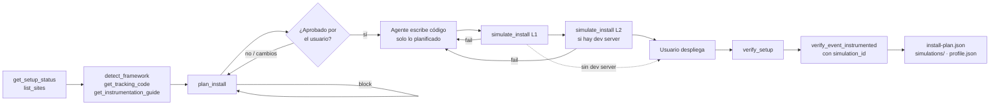

# PRD — Plan y Simulate para instalaciones con agente

**Versión:** 1.0 · **Fecha:** 14 septiembre 2026 · **Autor:** Rafa (Sealmetrics) con Claude
**Estado:** Borrador para revisión
**Base verificada:** `seal-copilot` main `7a1fb3a` (seal-install 1.12.0) · `sealmetrics2` main `57b2f55c` (`mcp-server`, `setup-core`, `tracker` v2.1, `pixel-service`)
**Repos afectados:** `sealmetrics2/setup-core`, `sealmetrics2/mcp-server`, `sealmetrics2/cli` (fase 4), `sealmetrics2/api` + `pixel-service` (fase 5), `seal-copilot/seal-install`, `seal-copilot/evals`
**Inspiración:** el ciclo `plan → apply → simulate` de [tagless](https://github.com/74minutos/tagless). De ahí solo tomamos el patrón, no el código.

---

## 1. Resumen ejecutivo

Hoy seal-install instala Sealmetrics así: detecta el framework, escribe código, el usuario despliega y **después** se verifica contra producción. Hay dos huecos:

1. **Nadie aprueba nada estructurado antes de que el agente toque el código.** El usuario solo acepta los términos de `provision_site`. Qué se va a medir, con qué nombres, qué propiedades y en qué archivos lo decide el agente y el usuario lo va descubriendo diff a diff.
2. **La única comprobación ocurre en producción, con datos reales y a ciegas.** `pixel-service` responde `204` a todo, también a lo que rechaza. Un evento con la revenue como string, con PII, demasiado grande o disparado desde un dominio no permitido no da ningún error visible. Y la PII que detecta `verify_event_instrumented` ya está guardada cuando la detecta.

Este PRD añade dos herramientas y cambia el procedimiento de seal-install:

- **`plan_install`** convierte la intención del agente en un **plan de instalación**: un documento legible, validado de forma determinista (taxonomía, PII, tipos, modo SPA, dominio, tamaño) y con un `plan_id` hash. El usuario lo aprueba y a partir de ahí es el contrato. Sin plan aprobado no se escribe código.
- **`simulate_install`** ejecuta **el tracker real** con las llamadas que ha escrito el agente, en un sandbox sin red. Captura el payload exacto que saldría hacia `pixel-service`, lo interpreta como lo haría el servidor y le aplica las mismas reglas de rechazo. Todo en segundos y antes de desplegar.

`verify_setup` y `verify_event_instrumented` se mantienen como confirmación final en producción. La regla de producto que atraviesa todo el documento es: **planificado ≠ simulado ≠ verificado**, y la salida de la skill nunca mezcla esas tres palabras.

---

## 2. Problema: evidencia verificada en el código

### P1 · La skill instala eventos que el verificador rechaza

La tabla del paso 4 de `seal-install/skills/install-sealmetrics/SKILL.md` propone 13 eventos. **8 no existen** en la taxonomía cerrada de `setup-core/src/instrument.ts` (`CONV_TYPES`, `MICRO_TYPES`). Con cualquiera de ellos, `verify_event_instrumented` devuelve `status: "rejected", reason: "out_of_taxonomy"`.

| Vertical | Propone la skill | Taxonomía canónica | Resultado |
|---|---|---|---|
| Ecommerce | `product_view` | `view_item` | rechazado |
| Ecommerce | `start_checkout` | `begin_checkout` | rechazado |
| Hotel | `room_view` | (no existe) | rechazado |
| Hotel | `booking_start` | (no existe; ¿`begin_checkout`?) | rechazado |
| SaaS | `demo_request` | (no existe; ¿`lead`?) | rechazado |
| SaaS | `trial_start` | (no existe; ¿`signup` con `plan: 'trial'`?) | rechazado |
| SaaS | `pricing_view` | (no existe) | rechazado |
| SaaS | `form_view` | (no existe) | rechazado |

El ejemplo de referencia de la skill (`examples/output.md`) marca `product_view` y `start_checkout` como "✅ confirmed". Con el verificador real eso no puede pasar, y es lo que el modelo toma como modelo a imitar.

### P2 · La PII se detecta cuando ya está guardada

`verify_event_instrumented` (`mcp-server/src/tools/setup.ts`) comprueba la PII sobre la fila leída de `/stats/conversions/raw`. Cuando devuelve `warning_pii`, el dato ya está en ClickHouse. Además, `detectPII` solo mira las claves de primer nivel: un `order_id` dentro de `items[]` no salta por nombre de clave.

### P3 · Solo se puede verificar en producción, y la skill prohíbe desplegar

`pixel-service/internal/handler/event.go` rechaza (`invalid_domain`, respuesta `204`) cualquier hit cuyo dominio no esté en la lista permitida de la cuenta (`internal/cache/domains.go`: sin dominio configurado, se rechaza). `localhost`, staging y las previews (`*.vercel.app`) no llegan nunca. Por eso `verify_setup` antes de desplegar **siempre** agota el tiempo.

La skill dice "Do not deploy". El ciclo que describe solo se cierra si el usuario despliega código sin probar. El ejemplo de referencia dice "Pixel confirmed 12 seconds after you opened the site" y a la vez "Nothing is deployed": con la configuración por defecto, esa secuencia no puede ocurrir.

### P4 · Todos los rechazos son silenciosos

Todos los caminos de rechazo de `event.go` responden `204`: `invalid_json`, `invalid_account`, `invalid_token`, `invalid_domain`, `blocklist_*`, `bot_detected` y `rate_limit`. Hay dos casos que un agente provoca con facilidad:

- **Revenue como string.** `tracker.js` solo añade `v` si `typeof amount === 'number'`. `sealmetrics.conv('purchase', order.total)` con `total = "149.99"` (lo normal si viene del DOM o de un dataLayer) envía la conversión **sin importe**. La conversión llega, `verify_event_instrumented` dice `verified` y la revenue queda a 0 para siempre.
- **Payload grande.** El handler lee con `io.LimitReader(r.Body, 15*1024)`. El tracker envía `d=<json>` url-encoded, lo que añade aproximadamente un 45 %. Un `purchase` con un `items[]` largo supera el límite, el JSON truncado da `invalid_json` y la compra se pierde sin rastro.

### P5 · `verify_event_instrumented` puede dar falsos positivos

Busca por nombre de evento y por recencia (`timestamp ≥ inicio − 5 s`). En un sitio con tráfico, el `add_to_cart` de un visitante real confirma el código del agente. Tampoco comprueba que estén las propiedades que importan (identificador de producto, `currency`).

### P6 · Fallos que ninguna herramienta actual ve

- **Pageviews dobles en SPA.** El tracker ya registra la navegación por History API (`spa=1` por defecto). Si el agente además dispara `sealmetrics()` al cambiar de ruta, cada navegación cuenta dos veces. Es el caso Desigual (PRD-034). **El ejemplo de referencia de seal-install enseña justo ese error**: "I also wired route changes in `app/providers.tsx`".
- **`sealmetrics is not defined`.** Pasa cuando una llamada se ejecuta antes de que cargue el tracker (`defer`) y no hay stub. La llamada lanza una excepción y el evento se pierde.
- **Snippet duplicado**, o convivencia con el tracker v1 (`window.sm`).
- **Identificador de producto incoherente** entre `view_item` y `add_to_cart` (distinta clave o distinto valor). Rompe el análisis por SKU. La propia skill avisa, pero nada lo comprueba.
- **URL del snippet inventada.** El ejemplo usa `cdn.sealmetrics.com/sm.js?id=`; el real es `t.sealmetrics.com/t.js?id=` (`mcp-server/src/tools/tracking.ts`).

### P7 · No queda constancia de lo acordado

No existe un documento de "qué se decidió medir". `setup-audit` no puede comparar lo planificado con lo que llega, y el siguiente agente que toque el sitio empieza de cero.

---

## 3. Objetivos y no-objetivos

### Objetivos

1. **Nada llega a producción sin simular.** El 100 % de los eventos que escribe seal-install pasa `simulate_install` antes de pedir el despliegue.
2. **Un plan aprobado por instalación.** Documento legible y con hash, persistido en disco, que el agente cita para escribir código y que la herramienta exige para simular.
3. **Detectar sin conexión las clases de fallo silencioso** de P1–P6 en segundos: taxonomía, PII, tipo de revenue, tamaño, duplicados, orden de carga y SPA.
4. **Separar las tres palabras.** Planificado, simulado y verificado se informan por separado; simular nunca cuenta como verificar.
5. **El plan como contrato.** `setup-audit` compara el plan con los datos reales y detecta desviaciones.

### No-objetivos (v1)

- **Desplegar.** Sigue siendo decisión del usuario.
- **Cambiar el tracker.** `tracker.js` no se toca; simulate lo ejecuta tal cual.
- **Simular en el conector remoto.** Ejecutar en nuestros servidores código propuesto por un agente es una superficie de seguridad que v1 no abre. Ver pregunta abierta 4.
- **Simular contenedores de GTM** (stub + `?auto=0&spa=0`). Candidato para v2.
- **Instalaciones mediante plugin de plataforma** (Shopify app embed, WordPress, PrestaShop). El plan sí aplica; la simulación no, porque el código lo inyecta el plugin.
- **Sustituir las validaciones del backend.** Simulate las replica; la autoridad sigue siendo `pixel-service`.
- **Tag manager o bundle compilado.** No convertimos Sealmetrics en tagless.

---

## 4. Usuarios y casos de uso

| Usuario | Contexto | Qué necesita del plan / simulate |
|---|---|---|
| **Developer del sitio** (principal) | Claude Code + seal-install sobre su repo | No romper la medición y no desplegar a ciegas |
| **Agencia** | Instala para varios clientes | Un plan que puede enviar al cliente para aprobar antes de facturar horas |
| **Solutions engineer de Sealmetrics** | Onboarding enterprise (tipo Desigual) | El plan como SOW técnico ligero; la simulación como prueba de entrega |
| **Seal Copilot** (`setup-audit`) | Semanas después | Leer el plan y comparar lo acordado con lo que llega |

**Casos de uso**

- **UC1 · Instalación nueva en ecommerce Next.js.** Plan con pageview automático, `view_item`, `add_to_cart`, `begin_checkout` y `purchase` con revenue. El usuario aprueba, el agente escribe el código, la simulación L1 detecta que `order.total` es string, el agente lo corrige con `Number()` y vuelve a simular: todo verde. El usuario despliega y se verifica.
- **UC2 · SaaS con nombres fuera de taxonomía.** El agente propone `demo_request`. `plan_install` lo bloquea y propone `lead` con `form_name: 'demo_request'`; el plan corregido pasa.
- **UC3 · SPA con router propio.** El agente propone disparar pageviews al cambiar de ruta. El plan lo bloquea por doble conteo salvo que el loader lleve `spa=0`.
- **UC4 · Cambio posterior.** El usuario pide añadir `newsletter_signup`. El `plan_id` cambia, hay que aprobar el delta y simular solo lo nuevo, más una regresión rápida del resto.
- **UC5 · Dev server disponible.** Simulación L2 en `localhost:3000`: el navegador hace clic en "Añadir al carrito", se captura el hit y se aborta antes de salir. Detecta una CSP que bloquea `t.sealmetrics.com`.
- **UC6 · Auditoría a los 14 días.** `setup-audit` lee `install-plan.json`: `begin_checkout` está planificado y verificado pero lleva 0 eventos en 7 días. Hay desviación y se abre diagnóstico.

---

## 5. Conceptos y flujo

| Concepto | Definición |
|---|---|
| **Plan de instalación** | JSON con la instalación completa: loader, modo SPA, eventos, disparadores, propiedades y ejemplos. Se renderiza como tabla para el usuario. |
| **`plan_id`** | Primeros 12 hex del SHA-256 del plan en JSON canónico (claves ordenadas y sin campos volátiles). Cualquier cambio produce un id nuevo. |
| **Aprobación** | Confirmación explícita del usuario en la conversación, con sus palabras (mismo estándar que los términos de `provision_site`). Se registra en disco. |
| **Simulación L1 · llamada** | Ejecuta el tracker real + las llamadas en `node:vm` con DOM mínimo y red capturada. Determinista y en menos de 3 s. Siempre se ejecuta. |
| **Simulación L2 · página** | Chromium headless contra el dev server local; intercepta los hits y los aborta. Opcional; necesita Playwright. |
| **Validador espejo** | Reglas de `pixel-service` portadas a TypeScript: parseo, `FlexStringMap`, límite de cuerpo, dominio y cuenta. |
| **Verificación** | Lo que ya existe: `verify_setup` y `verify_event_instrumented` contra producción. |
| **`simulation_id`** | Hash de `plan_id` + payloads capturados. Enlaza cada simulación con su verificación. |



---

## 6. Requisitos por epic

### E1 · Prerrequisito: una sola taxonomía — P0

Sin esto, plan y simulate bloquearían la mitad de lo que hoy propone la skill.

- **RF-101.** Reescribir la tabla del paso 4 de `install-sealmetrics/SKILL.md` con nombres canónicos. Propuesta mientras se resuelve la pregunta abierta 1:

  | Vertical | Conversiones | Microconversiones |
  |---|---|---|
  | Ecommerce | `purchase` (revenue) | `view_item`, `add_to_cart`, `begin_checkout` |
  | Hotel / travel | `booking` (revenue) | `view_item` con `item_type: 'room'`, `begin_checkout` |
  | SaaS / lead-gen | `signup` (`plan: 'trial'` para trials), `lead` (`form_name: 'demo_request'`), `subscription` (revenue) | `cta_click` (`cta: 'pricing'`), `form_submit` |

- **RF-102.** Corregir `examples/output.md`: nombres canónicos, URL real del snippet (`t.sealmetrics.com/t.js?id=`), sin cambios de ruta a mano (el tracker ya lo hace) y sin "pixel confirmed" antes de desplegar.
- **RF-103.** `evals/taxonomy.json`: snapshot de `CONV_TYPES` y `MICRO_TYPES`. `evals/lint-tool-calls.mjs` falla si un nombre de evento en `sealmetrics.conv('…')`/`micro('…')` o en una tabla de eventos de cualquier skill no está en el snapshot. `check-schema-drift.mjs --online` compara el snapshot con el que devuelve `get_instrumentation_guide`.

**Aceptación:** `scripts/check.sh` falla con `product_view` en cualquier skill y pasa con la tabla nueva.

---

### E2 · `plan_install` — P0

**Dónde:** lógica en `setup-core/src/plan/` (reutilizable desde CLI); herramienta registrada en `mcp-server/src/tools/setup.ts`. **Solo transporte local.** Anotaciones: `readOnlyHint: true`, `openWorldHint: true` (consulta los dominios del site).

#### Entrada

```jsonc
{
  "account_id": "acct_demo",                  // opcional: por defecto, el site provisionado
  "vertical": "ecommerce",                    // ecommerce | hotel | saas | leadgen | content
  "repo_path": "/abs/path/to/repo",           // opcional: activa las comprobaciones sobre el repo
  "site": { "domain": "demo-store.com", "framework": "next-app" },
  "loader": {
    "file": "app/layout.tsx",
    "snippet_url": "https://t.sealmetrics.com/t.js?id=acct_demo",  // tal cual lo devuelve get_tracking_code
    "auto_pageview": true,                    // se deriva de ?auto=
    "spa_pageview": true,                     // se deriva de ?spa=
    "stub": false,
    "content_group": { "strategy": "url_param", "value": "product" }  // opcional
  },
  "events": [
    {
      "kind": "micro",
      "name": "view_item",
      "trigger": { "type": "page", "where": "app/products/[slug]/page.tsx", "description": "Al renderizar la ficha de producto" },
      "properties": {
        "product_id": { "source": "product.id", "type": "string", "example": "SKU-123" },
        "product_name": { "source": "product.title", "type": "string", "example": "Camiseta básica" },
        "price": { "source": "product.price", "type": "number", "example": 19.9 }
      }
    },
    {
      "kind": "conv",
      "name": "purchase",
      "trigger": { "type": "page", "where": "app/checkout/success/page.tsx" },
      "value": { "source": "order.total", "type": "number", "example": 149.99 },
      "properties": {
        "currency": { "source": "order.currency", "type": "string", "example": "EUR" },
        "items": { "source": "order.items", "type": "list", "max_items": 50,
                   "item": { "product_id": "string", "quantity": "number", "price": "number" } }
      }
    }
  ],
  "product_identifier": { "key": "product_id", "applies_to": ["view_item", "add_to_cart", "purchase.items"] }
}
```

`trigger.type` ∈ `page | click | submit | route | datalayer | code`. `source` es texto libre (la expresión del código) y sirve para leer el plan; los `example` alimentan la simulación.

#### Salida

```jsonc
{
  "plan_id": "a3f9c21e7b04",
  "status": "ok",                              // ok | blocked
  "findings": [
    { "code": "PL-04", "severity": "warn", "event": "purchase",
      "message": "order.total suele venir como string del backend; el tracker descarta importes que no sean number.",
      "fix": "sealmetrics.conv('purchase', Number(order.total), …)" }
  ],
  "plan": { /* plan normalizado: nombres en minúsculas, loader derivado del snippet_url */ },
  "summary_markdown": "| Evento | Tipo | Dónde | Propiedades | Revenue |\n|---|---|---|---|---|\n…",
  "files_to_edit": ["app/layout.tsx", "app/products/[slug]/page.tsx", "…"],
  "estimate": { "events": 5, "max_payload_bytes": 9820 },
  "next_step": "Muestra summary_markdown y espera la aprobación explícita del usuario. No edites archivos hasta entonces."
}
```

#### Reglas (deterministas, sin modelo)

| Código | Regla | Severidad | Fuente de la verdad |
|---|---|---|---|
| PL-01 | Nombre fuera de taxonomía para su `kind`; incluye sugerencia | block | `validateEventName` |
| PL-02 | Clave de propiedad con forma de PII, **también dentro de `items[]` y objetos anidados** | block | `detectPII` recursivo (nuevo) |
| PL-03 | `example` con forma de email o teléfono | block | `EMAIL_RE`, `PHONE_RE` |
| PL-04 | `conv` de revenue (`purchase`, `subscription`, `booking` con importe) sin `value`, o con `value.type ≠ number` | block si falta, warn si el tipo es dudoso | `tracker.js` `conv()` |
| PL-05 | `value` declarado sin `currency` | warn | guía canónica |
| PL-06 | `product_identifier` ausente o con clave distinta entre `applies_to` | block en ecommerce, warn en el resto | skill paso 4 |
| PL-07 | Mismo `name` + `trigger.where` repetido | warn | — |
| PL-08 | Pageviews manuales (`trigger.type: route`, llamadas `sealmetrics()`) con `spa_pageview: true` | block (doble conteo) | PRD-034, `tracker.js` `urlChange` |
| PL-09 | `auto_pageview: false` sin pageview manual planificado | block (0 pageviews) | `tracker.js` |
| PL-10 | Disparadores `datalayer` o `code` en `<head>` sin `stub: true` | warn | stub contract, `tracker/CLAUDE.md` |
| PL-11 | `site.domain` no está en los dominios permitidos de la cuenta (`get_site`) | block (`invalid_domain`) | `pixel-service` `domains.go` |
| PL-12 | Tamaño estimado con `max_items` > 12 KB url-encoded (límite 15 KB) | warn; block si > 15 KB | `event.go` `LimitReader` |
| PL-13 | Con `repo_path`: ya hay un snippet de Sealmetrics o `window.sm` v1 en el repo | warn (duplicado) | `detect_framework` |
| PL-14 | Con `repo_path`: llamadas `sealmetrics.conv/micro` existentes que no están en el plan | warn (desviación) | escaneo estático |
| PL-15 | Funnel incompleto para el vertical (p. ej. ecommerce sin `add_to_cart`) | info | playbooks |
| PL-16 | `snippet_url` no coincide con el de `get_tracking_code` (host, `id`) | block | `tracking.ts` |
| PL-17 | Claves de propiedad fuera de `snake_case` o con más de 40 caracteres | info | convención |

`status: blocked` si hay al menos un `block`. El `plan_id` se calcula siempre, también con bloqueos, para que el agente pueda citar la versión que corrige.

#### Persistencia y aprobación

- **RF-201.** La herramienta no escribe en disco (RF-3204: el MCP nunca edita el repo del usuario). Lo persiste la skill:
  - `<state-dir>/<site_id>/install-plan.json` con `plan`, `plan_id`, `findings`, `approved_at` (ISO UTC) y `approval_quote` (la frase del usuario, recortada a 200 caracteres).
  - `<state-dir>/<site_id>/install-plan.md` con el render legible.
- **RF-202.** Contrato en `state-schema.md` de Seal Copilot (nueva sección `install-plan`).
- **RF-203.** Opcional, a elección del usuario: `.sealmetrics/plan.json` en el repo, para revisión en el PR y para el siguiente agente (pregunta abierta 2).

**Aceptación:** tests unitarios por regla en `setup-core/test/plan.test.ts`, con un caso positivo y uno negativo para cada `PL-xx`. El mismo plan en otro orden de claves produce el mismo `plan_id`.

---

### E3 · `simulate_install` L1 (llamada) — P0

**Dónde:** `setup-core/src/simulate/`. El tracker se incluye como artefacto de build (`tracker/dist/t.template.js` o `t.min.js`) con su hash. **Solo transporte local.** Anotaciones: `readOnlyHint: true`, `openWorldHint: false`.

#### Entrada

```jsonc
{
  "plan_id": "a3f9c21e7b04",
  "plan": { /* el plan aprobado, o */ },
  "plan_path": "/abs/.../install-plan.json",
  "level": "call",
  "cases": [
    {
      "event": "purchase",
      "code": "sealmetrics.conv('purchase', order.total, { currency: order.currency, items: order.items.map(i => ({ product_id: i.sku, quantity: i.qty, price: i.unitPrice })) })",
      "vars": { "order": { "total": "149.99", "currency": "EUR",
                           "items": [{ "sku": "SKU-123", "qty": 1, "unitPrice": 99.99 }] } },
      "context": { "url": "https://demo-store.com/checkout/success", "referrer": "https://demo-store.com/checkout", "before_tracker_load": false },
      "source": { "file": "app/checkout/success/page.tsx", "line": 42 }
    }
  ],
  "scenarios": ["load", "spa_navigation", "stub_queue"]   // opcional: por defecto se derivan del plan
}
```

- `code` es JavaScript plano. En TSX/JSX el agente pasa la llamada sin tipos. Si no hay `cases` para un evento, se genera uno a partir de los `example` del plan (marcado `synthetic: true`).
- `vars` son fixtures sintéticas. Los valores con forma de email o teléfono se rechazan.
- `context.before_tracker_load: true` ejecuta la llamada antes de cargar el tracker (con o sin stub, según el plan).

#### Ejecución

1. Contexto `node:vm` nuevo por caso, con un DOM mínimo: `window`, `document` (`referrer`, `title`), `location` (desde `context.url`), `navigator` (UA fijo, `languages`, `sendBeacon`), `screen`, `history` (`pushState`/`replaceState` reales sobre la URL simulada), `matchMedia`, `Intl`, `URLSearchParams`, `fetch` capturado. Sin `require`, `process` ni red. `Date.now` fijo.
2. Se inyectan los placeholders del tracker **como lo hace `pixel-service/internal/handler/tracker.go`**: `{{ACCOUNT_ID}}`, `{{TOKEN}}` (`sim-token`), `{{AUTO}}`/`{{SPA}}` como `"0"` solo si el parámetro del `snippet_url` es exactamente `0`, `{{GROUP}}` y `{{ENDPOINT}}` (`https://sim.invalid`).
3. Se ejecuta el tracker, luego `vars` y luego `code`, con un `timeout` de vm de 1000 ms por caso.
4. Se captura cada `sendBeacon`/`fetch`, se decodifica `d=` → JSON y se pasa por el **validador espejo** (E3.1).

#### E3.1 · Validador espejo de `pixel-service`

Módulo `setup-core/src/simulate/mirror.ts`. Cada regla cita su origen en Go:

| Regla | Réplica | Origen |
|---|---|---|
| Cuerpo > 15 × 1024 bytes → JSON truncado | `invalid_json` | `event.go` `io.LimitReader` |
| `d` ausente o JSON inválido | `invalid_json` | `event.go` `url.ParseQuery` + `json.Unmarshal` |
| `a` ≠ cuenta del plan | `invalid_account` | `cache/accounts.go` |
| Dominio de `u` vacío o fuera de los dominios permitidos (quitando `www.`, subdominios permitidos) | `invalid_domain` | `shouldRejectDomain`, `domains.go` |
| `x` → `map[string]string`: number entero → `"1"`, float → `%g`, bool → `"true"`, null → `""`, objetos y arrays → JSON | lo que **se guardará** | `models/event.go` `FlexStringMap` |
| `v` float64; ausente = 0 | importe almacenado | `EventPayload.Amount` |
| Tipo de evento: `e` vacío y sin `m` → pageview; `m` → micro; si no → conv | tipo | `determineEventType` |

Fuera del espejo, y documentado en la salida: `invalid_token` (el token es de prueba), `blocklist_*`, `bot_detected` y `rate_limit`, que dependen de estado de producción.

#### Comprobaciones

| Código | Comprobación | Resultado |
|---|---|---|
| SM-01 | Número de hits por caso = 1 (0 = no se ejecutó o lanzó; 2 o más = duplicado) | fail |
| SM-02 | Excepción en `code` (`sealmetrics is not defined`, `TypeError`…) | fail + mensaje y línea |
| SM-03 | `e` y `m` coinciden con `name` y `kind` del plan | fail |
| SM-04 | El plan declara `value` y el hit no lleva `v`, o `v = 0` con un ejemplo > 0. El mensaje dice el tipo recibido: *"amount must be a number: got string '149.99'"* | fail |
| SM-05 | Faltan propiedades planificadas en `x` | fail; extras no planificadas: warn |
| SM-06 | PII en el payload **real**: claves y valores, recursivo, también dentro de los JSON de `items` | fail |
| SM-07 | Tamaño del cuerpo url-encoded: > 15 KB fail, > 12 KB warn. Se informa del margen en bytes y del `max_items` que cabe | fail/warn |
| SM-08 | Regla espejo `invalid_*` activada | fail + motivo exacto |
| SM-09 | Identificador de producto: mismo valor en `view_item`, `add_to_cart` y `purchase.items[]` con la misma fixture | fail |
| SM-10 | Con `repo_path` y `source`: el archivo contiene una llamada `sealmetrics.conv\|micro('<name>'` en ±10 líneas de `source.line` | warn si no (el código simulado no es el del disco) |
| SM-11 | Muestra lo que se guardará (salida de `FlexStringMap`) | info |

#### Escenarios automáticos (derivados del loader del plan)

| Escenario | Qué hace | Esperado |
|---|---|---|
| `load` | Carga el tracker | 1 pageview si `auto`, 0 si no |
| `spa_navigation` | 2 × `pushState` + 1 `popstate`, más las pageviews manuales del plan | 3 pageviews exactas; más → **doble conteo** (fail); menos → pageviews perdidas |
| `stub_queue` | Llamadas antes de la carga | Con stub: se vacían en orden FIFO antes de la auto-pageview. Sin stub: SM-02 |
| `iframe` | `window.self !== window.top` | 0 pageviews automáticas (info; relevante en Shopify) |

#### Salida

```jsonc
{
  "simulation_id": "sim_7d21e09a44c3",
  "plan_id": "a3f9c21e7b04",
  "level": "call",
  "tracker": { "version": "2.1", "sha256": "…", "source": "vendored" },
  "verdict": "fail",                             // pass | fail
  "cases": [
    {
      "event": "purchase",
      "verdict": "fail",
      "hits": [{
        "body_bytes": 612,
        "payload": { "a": "acct_demo", "e": "purchase", "u": "https://demo-store.com/checkout/success", "x": { "currency": "EUR", "items": [ … ] } },
        "stored_as": { "event_type": "conversion", "conversion_type": "purchase", "amount": 0,
                       "properties": { "currency": "EUR", "items": "[{\"product_id\":\"SKU-123\",\"quantity\":1,\"price\":99.99}]" } }
      }],
      "checks": [
        { "code": "SM-04", "result": "fail",
          "message": "amount must be a number: got string '149.99'. La conversión llegaría con revenue 0.",
          "fix": "sealmetrics.conv('purchase', Number(order.total), …)" }
      ]
    }
  ],
  "scenarios": [ { "name": "spa_navigation", "verdict": "pass", "pageviews": 3 } ],
  "not_simulated": ["invalid_token", "blocklist", "bot_detected", "rate_limit"],
  "wording": "Simulado. No es una verificación: el evento aún no ha llegado a Sealmetrics."
}
```

**Aceptación:**
- Latencia p95 < 3 s para un plan de 8 eventos.
- Salida idéntica en dos ejecuciones con la misma entrada (salvo `duration_ms`).
- **Test de contrato cruzado** (E7): los mismos fixtures JSON pasan por `mirror.ts` y por `event.go`/`FlexStringMap` en Go, y producen el mismo `stored_as` y el mismo motivo de rechazo.

---

### E4 · `simulate_install` L2 (página) — P1

Para lo que L1 no puede ver: dónde se coloca de verdad el snippet, el orden de carga que impone el framework (`next/script` `afterInteractive`), la CSP, el router real, los errores de consola y el snippet duplicado en el DOM.

- **RF-401.** `level: "page"`, con `base_url` y `steps` por evento:

  ```jsonc
  {
    "plan_id": "a3f9c21e7b04",
    "level": "page",
    "base_url": "http://localhost:3000",
    "tracker_source": "cdn",                    // cdn | vendored
    "flows": [
      { "event": "add_to_cart", "steps": [
          { "goto": "/products/camiseta-basica" },
          { "click": "button[data-testid=add-to-cart]" },
          { "expect_hit": { "e": "add_to_cart", "m": true } } ] },
      { "event": "page_view", "steps": [
          { "goto": "/" }, { "click": "a[href='/products']" }, { "expect_pageviews": 2 } ] }
    ]
  }
  ```

- **RF-402.** Playwright es **dependencia opcional**. Si no está, la herramienta devuelve `status: "unavailable"` con el comando exacto (`npx playwright install chromium`, unos 150 MB). La skill **pide permiso** antes de instalarlo; nunca lo descarga por su cuenta.
- **RF-403.** Contexto de navegador nuevo: sin perfil del usuario, sin cookies y sin extensiones.
- **RF-404.** `base_url` solo en loopback por defecto (`localhost`, `127.0.0.1`, `[::1]`, `*.localhost`). Una URL de preview requiere `allow_remote_url: true`, que la skill solo pasa con confirmación explícita del usuario.
- **RF-405.** `page.route('**/event', …)` sobre el endpoint del tracker: **captura y responde `204` localmente**. Nunca llega a `pixel-service` y no ensucia datos. El hit capturado pasa por el mismo validador espejo, con dominio evaluado como `site.domain` del plan (en local el dominio real sería rechazado; se informa como `info`).
- **RF-406.** Límites: 20 pasos por flujo, 30 s por flujo, 120 s en total. Sin navegación fuera del origen salvo al tracker.

**Comprobaciones adicionales**

| Código | Comprobación |
|---|---|
| SP-01 | `script[src*="/t.js"]` aparece **exactamente una vez** en el DOM tras la hidratación |
| SP-02 | El tracker carga (respuesta 200 del CDN, o vendorizado) y `window.sealmetrics` existe |
| SP-03 | `securitypolicyviolation` sobre el host del tracker o su endpoint → CSP bloquea la medición |
| SP-04 | Errores de consola que mencionan `sealmetrics` o que ocurren en la línea del `source` planificado |
| SP-05 | Cada `expect_hit` se cumple con exactamente un hit dentro de 5 s |
| SP-06 | Pageviews por navegación real del router = 1 |
| SP-07 | Captura de pantalla **solo si falla**, guardada en local en `<state-dir>/<site_id>/simulations/` |

**Aceptación:** app de ejemplo en `sealmetrics2/test-site` con 4 variantes rotas (sin stub, CSP, doble pageview, snippet duplicado). L2 detecta las 4; L1 detecta 2.

---

### E5 · Integración con la verificación — P1

- **RF-501.** `verify_event_instrumented` acepta `expect` opcional:

  ```jsonc
  { "expect": { "value_min": 0.01, "properties_required": ["product_id", "currency"], "simulation_id": "sim_7d21e09a44c3" } }
  ```

  Si la fila de producción no cumple `expect`, devuelve `status: "mismatch"` con la diferencia frente al `stored_as` simulado (claves que faltan, `amount` 0 cuando la simulación tenía importe). Captura diferencias entre el entorno de desarrollo y el de producción (build, dataLayer real).
- **RF-502.** Reducir los falsos positivos de P5 sin tocar el backend: con `expect.value_exact`, la skill pide al usuario una compra de prueba con un importe reconocible (p. ej. 1,23) y el verificador cruza nombre, importe y tiempo. Sin importe (micro), se informa `verified_by_recency` en lugar de `verified` cuando `get_overview` de hoy muestra tráfico > 0 en la ventana.
- **RF-503.** `detectPII` en el verificador pasa a ser recursivo (misma función que PL-02 y SM-06).

---

### E6 · Cambios en la skill `install-sealmetrics` — P0

Procedimiento nuevo (el orden importa y se mantiene numerado):

0. **Punto de partida:** `get_setup_status`, `list_sites`. Sin cambios.
1. **Crear el site** solo si no existe, con la puerta de términos. Sin cambios.
2. **Descubrir:** `detect_framework`, `get_tracking_code`, `get_instrumentation_guide`. Preguntar qué vende o capta el sitio.
3. **Planificar (nuevo).** Construir el plan con nombres de la guía y llamar a `plan_install` con `repo_path`.
   - Con `block`: corregir y volver a planificar, **sin enseñar al usuario un plan bloqueado como propuesta**.
   - Mostrar `summary_markdown`, los `warn` en una línea cada uno y la lista de archivos.
   - **Esperar a que el usuario apruebe con sus palabras.** "Instálalo" al principio de la conversación no es aprobar el plan.
   - Guardar `install-plan.json` y `.md` con `approval_quote`.
4. **Colocar el snippet** según el plan.
5. **Instrumentar** solo los eventos del plan. Si el usuario pide un cambio → vuelta al paso 3 con el delta.
6. **Simular (nuevo).** `simulate_install` L1 con un caso por evento y la llamada tal como quedó en el código.
   - `fail` → corregir → volver a simular. **Máximo 3 iteraciones**; después, parar e informar de lo que sigue fallando.
   - Con dev server en marcha (lo dice el usuario o `package.json` tiene `dev` y el puerto responde): ofrecer L2. Pedir permiso para instalar Playwright si falta.
   - Guardar el resultado en `<state-dir>/<site_id>/simulations/<simulation_id>.json`.
7. **Pedir el despliegue.** El usuario despliega; la skill no.
8. **Verificar el pixel:** `verify_setup`.
9. **Verificar cada evento:** `verify_event_instrumented` con `expect` derivado del plan y el `simulation_id`.
10. **Entrega:** `profile.json` (sin cambios) + referencia a `install-plan.json` + tabla final.

**Tabla final obligatoria**, con tres columnas de estado que nunca se fusionan:

| Evento | Tipo | Dónde | Planificado | Simulado | Verificado en producción |
|---|---|---|---|---|---|
| `view_item` | micro | `app/products/[slug]/page.tsx` | ✓ `a3f9c21e7b04` | ✓ L1 · L2 | ✓ |
| `purchase` | conv | `app/checkout/success/page.tsx` | ✓ | ✓ L1 | pendiente: falta una compra de prueba |

**RF-601 · Reglas nuevas en "What you do NOT do"**

- No editar archivos de instrumentación antes de que el usuario apruebe el plan.
- No escribir llamadas a eventos que no estén en el plan aprobado.
- No decir "verificado", "confirmado" ni "funciona" tras una simulación. La palabra es "simulado".
- No ejecutar L2 contra una URL que no sea local sin confirmación explícita.
- No instalar Playwright sin permiso.
- No presentar como propuesta un plan con `status: blocked`.

**RF-602.** Presupuesto de llamadas de 15 a **22** (plan ×2, simulate ×2, más holgura para la verificación con `expect`). Actualizar el pie de `runs.jsonl` (`budget: 22`).
**RF-603.** Nuevo `examples/output.md` con la tabla de tres estados, un fallo SM-04 corregido y la frase de despliegue.
**RF-604.** `evals/tool-availability.json`: añadir `plan_install` y `simulate_install` a `gated` (solo locales). El linter exige `(local only)` en cualquier mención fuera de seal-install.
**RF-605.** `plugin.json` de seal-install: versión 1.13.0; la descripción menciona "plans and simulates before anything ships".

---

### E7 · Evals, tests y contrato — P0/P1

**setup-core (vitest)**

- Un test positivo y uno negativo por regla `PL-xx` y `SM-xx`.
- `tracker-hash.test.ts`: el tracker vendorizado coincide byte a byte con `tracker/dist/t.template.js`. Si alguien recompila el tracker sin actualizar setup-core, CI falla.
- `determinism.test.ts`: dos ejecuciones producen la misma salida.

**Contrato cruzado TS ↔ Go (P0)**

- `sealmetrics2/fixtures/sim-contract/*.json` con pares entrada (cuerpo HTTP) → `stored_as` / `rejection_reason`. Mínimo: número entero en `x`, float, bool, null, array `items`, cuerpo de 15 KB + 1, `d` ausente, dominio `www.` y subdominio, dominio vacío.
- `setup-core/test/mirror.contract.test.ts` y `pixel-service/internal/handler/mirror_contract_test.go` leen los mismos archivos. Un cambio en las reglas del servidor que no se replique en el espejo rompe CI en el propio PR del backend.

**seal-copilot evals (mock server, conector local)**

| Caso | Fixture | Afirma |
|---|---|---|
| `install-plan-blocks-out-of-taxonomy` | saas, el usuario pide "demo requests" | Llama a `plan_install`; el plan final usa `lead`; nunca escribe `demo_request` |
| `install-plan-blocks-pii` | ecommerce con `order_id` en el pedido | El plan final no contiene `order_id` |
| `install-waits-for-approval` | ecommerce | Ninguna edición de archivos entre `plan_install` y el mensaje de aprobación |
| `install-change-requires-replan` | petición de añadir evento tras la aprobación | Nuevo `plan_install` antes de editar |
| `install-simulate-catches-string-amount` | `order.total` string | `simulate_install` fail SM-04 → corrección con `Number()` → pass |
| `install-simulate-spa-double-count` | Next.js con cambio de ruta a mano | PL-08 o escenario `spa_navigation` fail; la solución quita la llamada manual |
| `install-never-says-verified-after-simulate` | sin despliegue | La salida no contiene "verificado", "confirmed" ni "✅ confirmed" para eventos no verificados |
| `install-playwright-asks-first` | L2 sin Playwright | Pregunta antes de instalar |
| `install-plan-blocked-not-proposed` | plan con block | El usuario nunca ve un plan bloqueado como propuesta |

---

### E8 · CLI y CI del cliente — P2

- **RF-801.** `sealmetrics plan --file .sealmetrics/plan.json` y `sealmetrics simulate --plan .sealmetrics/plan.json --cases .sealmetrics/cases.json` en `sealmetrics2/cli`, reutilizando `setup-core`. Salida NDJSON como el resto de la CLI.
- **RF-802.** Código de salida ≠ 0 si hay fail. Receta de GitHub Action en la documentación: un PR que renombra `product_id` o convierte `total` en string rompe el CI **del cliente** antes de llegar a producción.

Es la parte que convierte una instalación puntual en protección continua. Va en P2 porque depende de que el plan viva en el repo (pregunta abierta 2).

---

### E9 · El plan como contrato para `setup-audit` — P2

- **RF-901.** `setup-audit` lee `install-plan.json` si existe y compara plan con datos de los últimos 7 días:
  - Planificado y verificado, 0 eventos → **"instrumentado, no se ve"**.
  - Visto y no planificado → **desviación** (alguien añadió código fuera del plan).
  - Propiedad planificada ausente en `list_property_keys` → **propiedad perdida**.
  - `purchase` con `amount = 0` en más del 5 % de las filas → **revenue rota** (el SM-04 que se escapó).
- **RF-902.** Un hallazgo de E9 recomienda volver a planificar y simular, no parchear.

---

### E10 · Visibilidad de rechazos en el backend — P2

Hoy todo rechazo es un `204` mudo. `publishRejected` publica en `events.rejected` y la tabla `hits_log` guarda `status` y `rejection_reason` (TTL 1 día). `bot_stats.py` ya la consulta.

- **RF-1001.** Endpoint `GET /setup/rejections?site_id=&since=` (ámbito `sites:read`, accesible con clave de API) → conteo por `rejection_reason` en los últimos N minutos. Solo agregados, sin IP ni UA.
- **RF-1002.** `verify_setup` y `verify_event_instrumented`, al agotar el tiempo, consultan el endpoint y responden con la causa: *"0 hits aceptados; 14 rechazados por invalid_domain en los últimos 5 min. ¿Estás probando en localhost o en una preview?"*
- **RF-1003 (a estudiar).** Modo debug estilo DebugView de GA4: `t.js?debug=<nonce>` marca los hits, se guardan en una tabla aparte de TTL corto, se excluyen de informes y el verificador los empareja por nonce. Resuelve de raíz P3 (dominios de prueba) y P5 (falsos positivos). Requiere revisión legal (pregunta abierta 6).

---

## 7. Experiencia: cómo se ve en la conversación

> **Usuario:** instala Sealmetrics en la tienda
>
> **Agente:** Tu cuenta no tiene site para `demo-store.com`; lo creo tras aceptar términos (…). Next.js 14 con App Router.
>
> **Plan de instalación** `a3f9c21e7b04`
>
> | Evento | Tipo | Dónde | Propiedades | Revenue |
> |---|---|---|---|---|
> | pageview | auto | `app/layout.tsx` (snippet en `<head>`) | — | — |
> | `view_item` | micro | ficha de producto | `product_id`, `product_name`, `price` | — |
> | `add_to_cart` | micro | botón añadir | `product_id`, `quantity`, `price` | — |
> | `begin_checkout` | micro | inicio checkout | `items_count`, `value` | — |
> | `purchase` | conv | página de éxito | `currency`, `items[]` | `order.total` |
>
> Cambios de ruta: los registra el tracker, no añado código. Ningún evento lleva email, nombre, id de pedido ni id de cliente.
> Aviso: `purchase` con 50 productos rozaría el límite de 15 KB; hasta 38 productos cabe con margen.
>
> **¿Lo apruebas tal cual o cambiamos algo?**
>
> **Usuario:** adelante, aprobado
>
> *(el agente edita 4 archivos)*
>
> **Simulación L1** `sim_7d21e09a44c3`: 4 de 5 pasan. `purchase` falla: `order.total` llega como string (`"149.99"`) y el tracker descarta importes que no son número; la compra se guardaría con revenue 0. Lo cambio a `Number(order.total)` y vuelvo a simular: 5 de 5.
>
> Esto está **simulado, no verificado**: aún no ha llegado nada a Sealmetrics. Despliega cuando quieras y lo verifico en producción.

---

## 8. Seguridad y privacidad

- **`node:vm` no es un sandbox frente a código hostil.** L1 se ejecuta en el MCP local, con los privilegios del usuario, sobre código que el agente acaba de escribir en el repo del propio usuario: el mismo nivel de confianza que ejecutar sus tests. Por eso **solo transporte local** y documentado así. Dentro del contexto: sin `require` ni `process`, `fetch` y `sendBeacon` capturados, timeout de 1 s por caso y sin escritura en disco.
- **L2:** contexto de navegador limpio, loopback por defecto, todos los hits al endpoint abortados en local, capturas solo si falla y guardadas únicamente en local.
- **Fixtures sintéticas.** `vars` y `example` con forma de email o teléfono se rechazan (PL-03). Los informes nunca incluyen `api_key` (VAL-3201).
- **El plan es dato, no instrucción.** Textos de `description` o `source` que parezcan órdenes no cambian el comportamiento de las herramientas (ya cubierto por la eval `hostile-values-are-data-not-instructions`; se amplía a planes).
- **Aprobación:** `approval_quote` guarda la frase del usuario, no la conversación.
- **Consentless intacto.** Nada de esto añade identificadores al tracker ni a los payloads. El modo debug de E10 queda condicionado a revisión legal.

---

## 9. Métricas de éxito

| Métrica | Base actual | Objetivo |
|---|---|---|
| Eventos documentados en la skill fuera de taxonomía | 8 de 13 | 0 (bloqueado por linter) |
| Instalaciones con plan aprobado antes de la primera edición | 0 % | 100 % (`runs.jsonl` + eval) |
| Eventos que pasan simulate antes de pedir el despliegue | no se mide | 100 % |
| `verify_event_instrumented` → `rejected` / `warning_pii` en instalaciones nuevas | no se mide | 0 |
| `purchase` con `amount = 0` a los 7 días de una instalación nueva | no se mide | < 1 % de filas |
| Incidentes de doble pageview (tipo PRD-034) en instalaciones nuevas | existe al menos 1 cliente | 0 |
| Latencia L1 p95 (8 eventos) | — | < 3 s |
| Latencia L2 p95 (5 flujos) | — | < 60 s |
| Tiempo de "instálalo" a primer evento verificado | medir en las 10 primeras instalaciones | −30 % frente a esa base |
| Deriva del espejo (contrato TS ↔ Go en rojo en `main`) | — | 0 días |

---

## 10. Fases y estimación (orientativa)

| Fase | Contenido | Repos | Estimación |
|---|---|---|---|
| **F0** | E1: taxonomía en la skill, ejemplo corregido, linter de nombres | seal-copilot | 0,5–1 d |
| **F1** | E2 `plan_install` + E3 L1 + validador espejo + contrato TS ↔ Go + tests | sealmetrics2 | 5–6 d |
| **F2** | E6 skill + E7 evals + `tool-availability` + release seal-install 1.13.0 y `@sealmetrics/mcp` minor | seal-copilot, sealmetrics2 | 2–3 d |
| **F3** | E4 L2 (Playwright opcional, CSP, consola, DOM) + variantes rotas en `test-site` | sealmetrics2 | 4–5 d |
| **F4** | E5 `expect` en el verificador + E8 CLI | sealmetrics2 | 3–4 d |
| **F5** | E10 endpoint de rechazos; E9 `setup-audit` lee el plan | sealmetrics2, seal-copilot | 4–6 d |

**F0 se puede hacer hoy y es independiente:** corrige un fallo real con o sin el resto del PRD. F1 + F2 forman la primera entrega con valor (unos 8 días). F3 en adelante se prioriza con datos de las primeras instalaciones.

---

## 11. Riesgos y dependencias

| Riesgo | Impacto | Mitigación |
|---|---|---|
| El espejo diverge de `pixel-service` | Simulación verde, producción roja | Contrato de fixtures compartido en CI de ambos lados (E7) |
| Se recompila el tracker y setup-core queda desfasado | Simula otro tracker | Test de hash del tracker vendorizado |
| Falsa sensación de seguridad | El usuario da por buena la medición sin verificar | Tabla de tres estados, eval `never-says-verified`, verificación obligatoria tras desplegar |
| L1 simula lo que el agente dice, no lo que hay en disco | Desviación silenciosa | SM-10 (la llamada existe en el archivo) + L2 cuando haya dev server |
| El agente se salta el plan | Vuelve el problema actual | `simulate_install` exige `plan_id` y marca eventos `not_in_plan`; evals de aprobación |
| Taxonomía demasiado cerrada para hotel y SaaS | Planes forzados o bloqueos frustrantes | Decisión de producto (pregunta 1) antes de F1 |
| Peso de Playwright | Fricción de instalación | Opcional; L1 cubre la mayoría de fallos de P1–P6 |
| `next/script` y otros transforman el orden de carga | L1 no lo ve | L2 (SP-02, SP-04) |
| Estado de producción no replicable (`bot_detected`, `rate_limit`, blocklist) | Un pass que luego se rechaza | `not_simulated` explícito en la salida; E10 hace visible el rechazo real |
| Verificación con muchas pageviews de prueba seguidas | La sesión del tester se marca como bot y la verificación falla | La skill avisa de no recargar en bucle; E10 muestra `bot_detected` |

**Dependencias:** acceso a `get_site` con clave (`sites:read`, ya disponible) para PL-11; `tracker/dist` publicado como artefacto consumible por `setup-core`; decisión sobre la taxonomía.

---

## 12. Preguntas abiertas

1. **Taxonomía.** ¿Se amplía (`room_view`, `pricing_view`, `form_view`, `demo_request`, `trial_start`) o se mapea a eventos canónicos con propiedades como propone RF-101? Afecta al análisis por vertical de Seal Copilot. Decide producto antes de F1.
2. **¿El plan vive en el repo del cliente** (`.sealmetrics/plan.json`)? A favor: revisión en el PR, CI (E8) y memoria para el siguiente agente. En contra: un archivo más en su repo. Propuesta: opcional, ofrecido al final de la instalación.
3. **¿`events.rejected` acaba siempre en `hits_log`?** `publishRejected` publica en `events.rejected` y el consumidor de log lee `events.log`. Hay que confirmar el binding de RabbitMQ antes de comprometer E10. Además, `invalid_json` llega sin `account_id` y no se puede filtrar por cuenta.
4. **¿`plan_install` en el conector remoto?** Es validación pura, sin ejecutar código. Daría planes revisables a usuarios de Claude.ai que pegan el snippet a mano. Implica sacarlo del bloque `omitSetupTools` del remoto.
5. **Tracker de agentes.** Para cuentas con `agent_analytics_enabled` se sirve `tracker-agent.js` (payload con `ag`). ¿Simulate debe usar esa variante según la cuenta?
6. **Modo debug (E10).** ¿Un nonce de depuración en producción afecta a la posición consentless? Revisión legal antes de diseñarlo.
7. **Nombres.** `plan_install`/`simulate_install` frente a `plan`/`simulate`. Propuesta: con sufijo, porque el MCP tiene 62 herramientas y "plan" es ambiguo.
8. **GTM.** El patrón canónico enterprise es stub + `?auto=0&spa=0` desde GTM. ¿Importar el export del contenedor para simular (idea de `import_gtm` de tagless) en v2?

---

## Anexo A · Payload del tracker v2.1

Referencia para leer las simulaciones. Origen: `tracker/src/tracker.js` y `pixel-service/pkg/models/event.go`.

| Clave | Campo en servidor | Tipo | Notas |
|---|---|---|---|
| `a` | `account_id` | string | Debe existir y estar activa |
| `s` | `session_id` | string | Hash de huella; el servidor lo pseudonimiza a diario (PRD-041) |
| `t` | `token` | string | HMAC de 24 h; en simulación, `sim-token` |
| `u` | `current_url` | string | Su dominio decide `invalid_domain` |
| `r` | `referrer_url` | string | En SPA, la URL anterior |
| `z` | `timezone` | string | IANA |
| `c` | `clicktime` | int64 ms | — |
| `g` | `content_grouping` | string | Opcional |
| `e` | `conversion_type` | string | Vacío = pageview |
| `v` | `amount` | float64 | Solo si `typeof amount === 'number'` |
| `m` | `is_microconversion` | bool | — |
| `x` | `properties` | `map[string]string` | `FlexStringMap`: objetos y arrays se guardan como JSON en string |

Transporte: `sendBeacon` (o `fetch` keepalive) a `{{ENDPOINT}}/event`, cuerpo `application/x-www-form-urlencoded` con `d=<json>`, máximo 15 KB leídos.

## Anexo B · Correspondencia de reglas con los problemas

| Problema | Plan | Simulate L1 | Simulate L2 | Verificación / backend |
|---|---|---|---|---|
| P1 taxonomía | PL-01 | SM-03 | — | ya existe |
| P2 PII guardada | PL-02, PL-03 | SM-06 | — | RF-503 |
| P3 dominios de prueba | PL-11 | SM-08 | info | E10 |
| P4 revenue string | PL-04 | SM-04 | SP-05 | RF-501 |
| P4 tamaño | PL-12 | SM-07 | SP-05 | E10 |
| P5 falso positivo | — | `simulation_id` | — | RF-502 |
| P6 doble pageview SPA | PL-08 | `spa_navigation` | SP-06 | E9 |
| P6 `sealmetrics is not defined` | PL-10 | SM-02, `stub_queue` | SP-02, SP-04 | — |
| P6 snippet duplicado | PL-13 | SM-01 | SP-01 | — |
| P6 identificador incoherente | PL-06 | SM-09 | — | E9 |
| P6 URL de snippet inventada | PL-16 | — | SP-02 | — |
| P7 sin constancia | `install-plan.json` | `simulations/` | `simulations/` | E9 |
